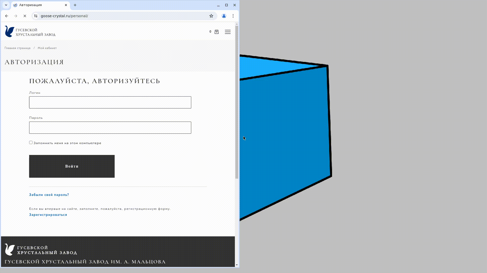

# В чем польза покрытия тестами [сайта Гусевского хрустального завода](https://www.goose-crystal.ru/)

Сайт — важный инструмент для представления продукции и взаимодействия с клиентами. Для обеспечения его надежности и
качества необходимо внедрение тестирования.
Вот несколько причин, почему покрытие тестами критически важно:

1. **Повышение качества**: Тестирование помогает выявить ошибки и недочеты на ранних стадиях разработки, что
   способствует созданию более качественного продукта.

2. **Улучшение пользовательского опыта**: Регулярное тестирование функциональности сайта гарантирует, что пользователи
   смогут без проблем находить информацию и совершать покупки.

3. **Снижение затрат на поддержку**: Выявление и исправление ошибок на этапе тестирования обходится значительно дешевле,
   чем исправление проблем после запуска сайта.

4. **Поддержка изменений**: Сайт будет регулярно обновляться и улучшаться. Наличие тестов позволяет уверенно вносить
   изменения, не опасаясь сломать существующую функциональность.

5. **Доверие клиентов**: Надежный и стабильный сайт формирует доверие у клиентов, что в свою очередь способствует
   увеличению продаж и укреплению репутации завода.

Внедрение тестирования на сайте Гусевского хрустального завода — это инвестиция в его будущее и успешное развитие.

[](https://www.java.com)[](https://gradle.org)[](https://www.jetbrains.com/idea)[](https://selenide.org)[](https://aerokube.com/selenoid)[](https://junit.org/junit5)[](https://www.jenkins.io)[](https://docs.qameta.io/allure)[](https://telegram.org)

Вот несколько примеров простых тестов для сайта завода:

- [x] Наличие ссылки на логотип завода на главной странице
- [x] Находим рыбницу с помощью фильтрации в каталоге
- [x] На странице конкретной экскурсии есть инф.блоки 2 других экскурсий
- [x] Проверяем корректность адреса магазина в Суздале
- [x] Наличие алерта при безуспешной авторизации

Запуск тестов из командной строки:

```
gradle clean goose_test
```

Отчетность о прогоне тестов в Telegram позволит оперативно отслеживать потенциальные и уже существующие проблемы на
сайте

### Пример такого отчета в Telegram:


### Пример Allure-отчета:


### Прогон автотестов в Jenkins:


### Видео прогона одного из автотестов

)


